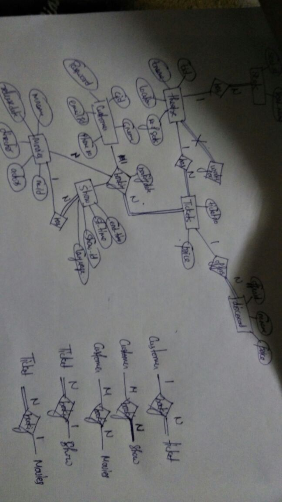

# Python-flask-API-for-Students
    It is an API created for storing details of a student in flask framework of Python

EXTRAS
    
    Web Scraping
        Using Beautiful Soup
        
    Web Automation
        Using Selenium Driver
        
        Extracted DATA about bus stages from a website
        

        
